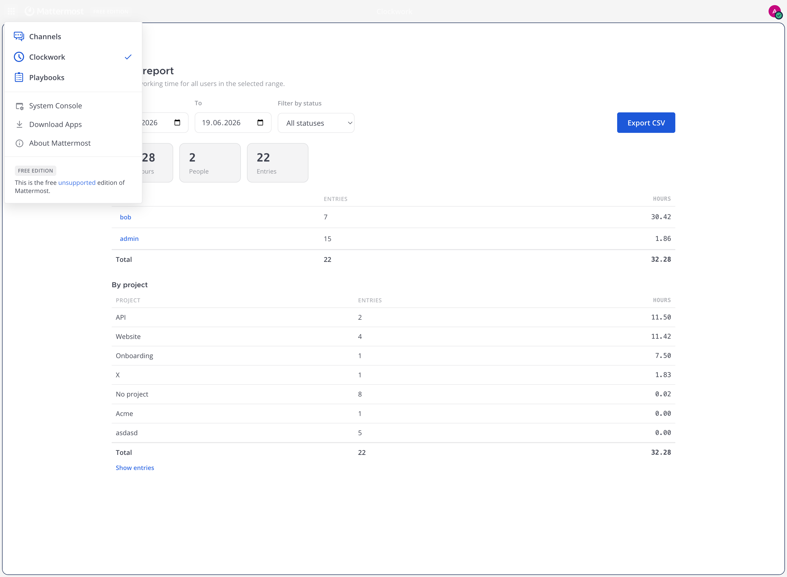
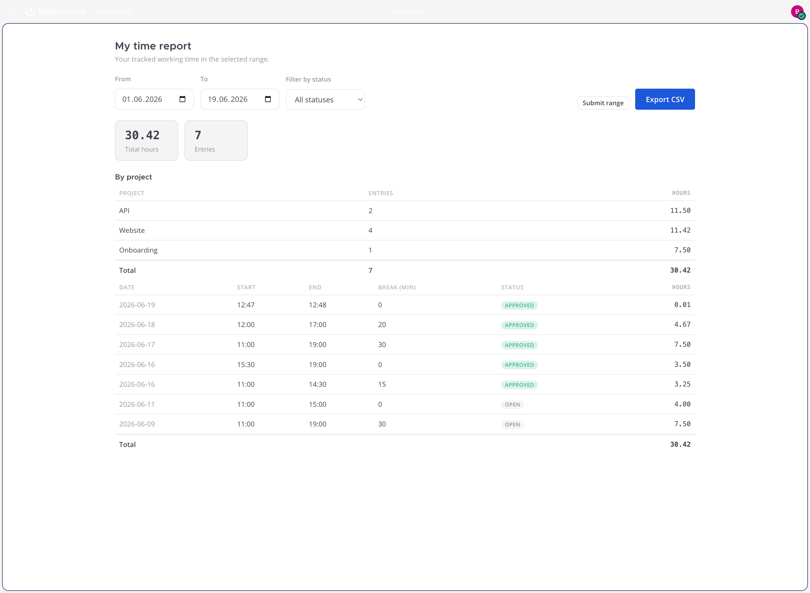
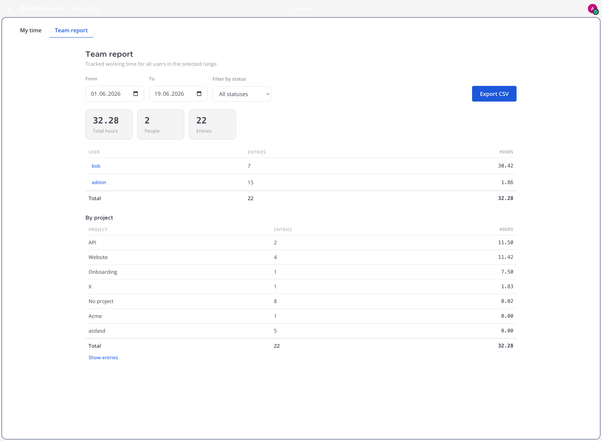
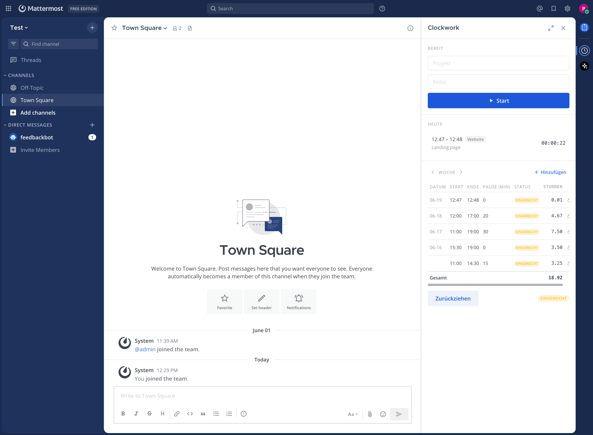
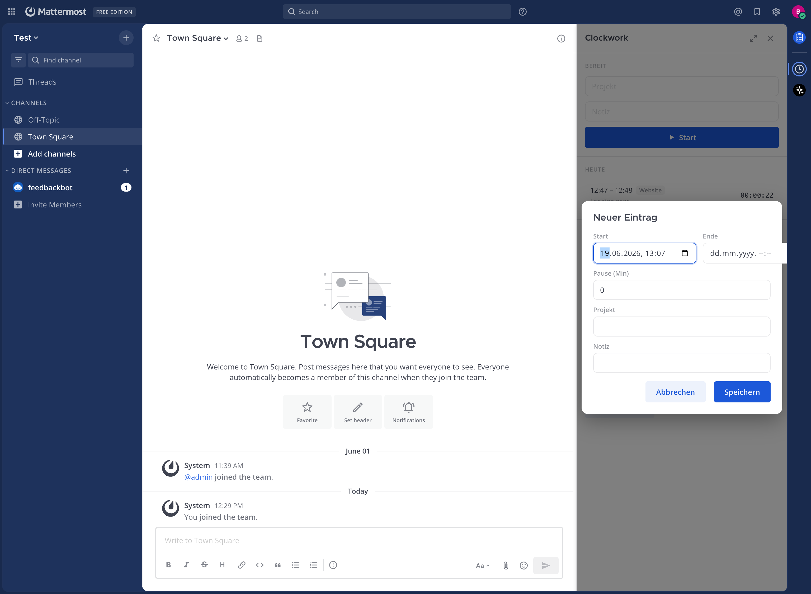

# Clockwork — Mattermost Time Tracking (Arbeitszeiterfassung)

[](https://github.com/mrvnklm/mattermost-plugin-clockwork/actions/workflows/ci.yml)

A native Mattermost plugin for tracking working hours directly inside Mattermost —
clock in/out with breaks, a weekly timesheet, manual corrections, and CSV export.
Built compliance-first for German *Arbeitszeiterfassung* (records start, end,
breaks and net daily hours), with an optional project/description per entry.

- **Plugin id:** `com.mrvnklm.clockwork`
- **Min server version:** 9.0.0 (self-hosted). **PostgreSQL** is the target database — it's Mattermost's standard since v8.0 and the only DB [supported from Mattermost v11](https://docs.mattermost.com/product-overview/deprecated-features.html). MySQL still works (and is covered by the integration suite) for older deployments, but is deprecated upstream; new installs should use PostgreSQL.
- **License:** Apache-2.0 · German + English UI

## Features

- **Right-hand-side panel** (clock button in the channel header):
  - Live running timer with **Start / Stop / Break** (pause & resume).
  - Optional **project** and **note** per entry, with **autocomplete** from your previously-used values.
  - **Today** list and a **weekly timesheet** (start, end, breaks, net hours, week total).
  - Add / edit / delete entries manually (timezone-correct, DST-safe).
- **Slash command** `/track in|out|break|status` for fast clocking.
- **Clockwork product** (full-page, in the product switcher next to Channels/Playbooks):
  - **Every user** gets their own time report — date range, totals, per-project breakdown,
    CSV export, and (with the approval workflow on) submit/withdraw.
  - **System admins** get a **My time ↔ Team report** toggle; the team report adds per-user
    drill-down and the approval actions, with a CSV export that honours the selected user.
- **Optional approval workflow** (off by default — see [Configuration](#configuration)):
  employees **submit a week** for approval; admins **approve** (locks the entries from
  further edits) or **reject** (reopens them). Submitted/approved entries are read-only
  for their owner.
- **CSV export** for your own records, and for admins across the team (formula-injection safe).
- Net hours = `end − start − breaks`; days are grouped in each user's Mattermost timezone.

| Product switcher | Personal report (every user) | Team report (admins) |
|---|---|---|
|  |  |  |

| Quick-timer panel (RHS) | Edit / add entry |
|---|---|
|  |  |

## Architecture

A single bundle: a **Go server** component (slash command, REST API, SQL persistence
in the Mattermost database) and a **React/TypeScript webapp** (RHS quick-timer panel +
full-page Clockwork product). One table, `timetracking_entries`; a running entry is a row with
`end_at IS NULL`, and each entry carries an approval `status` (`open` → `submitted` →
`approved`) that gates owner edits. The server authorizes every request via the
`Mattermost-User-ID` header; admin endpoints require `PermissionManageSystem`, and the
approval-workflow endpoints are feature-flagged off by default.

```
plugin.json                 manifest (id, min_server_version, icon)
server/
  plugin.go                 wiring: store + command + router
  api.go                    REST handlers, auth, CSV/summary, admin
  command/command.go        /track slash command
  store/store.go            TimeEntry + Store interface (contract)
  store/sqlstore.go         Postgres/MySQL implementation
  store/migrations.go       idempotent schema (+ partial unique index)
webapp/src/
  index.tsx                 RHS + header button + product registration
  client/Client.ts          typed REST client (CSRF-aware)
  components/rhs/RHSView.tsx, components/WeeklyTimesheet.tsx, components/EntryEditModal.tsx
  components/ClockworkApp.tsx, components/PersonalReport.tsx   full-page product (role-based)
  components/admin/AdminConsole.tsx, AdminTable.tsx, AdminProjectSummary.tsx
  utils/time.ts, styles.ts, icons.tsx, i18n.ts
docs/API_CONTRACT.md        the server⇄webapp REST contract
```

## Build

Requires the Node version in `.nvmrc` (`nvm i`) and the Go toolchain.

```sh
make dist        # → dist/com.mrvnklm.clockwork-<version>.tar.gz
make check-style # lint (Go + webapp)
make test        # go test ./... + webapp jest
```

## Deploy to a dev server

Enable plugin uploads + local mode in the server `config.json`:

```json
"PluginSettings": { "EnableUploads": true },
"ServiceSettings": { "EnableLocalMode": true, "LocalModeSocketLocation": "/var/tmp/mattermost_local.socket" }
```

```sh
export MM_SERVICESETTINGS_SITEURL=http://localhost:8065
export MM_ADMIN_TOKEN=<token>     # or MM_ADMIN_USERNAME/MM_ADMIN_PASSWORD
make deploy                        # build + install via pluginctl
MM_DEBUG=1 make deploy             # unminified webapp + debuggable server
```

Or upload `dist/*.tar.gz` via **System Console → Plugins → Management**.

## Usage

- Click the **clock icon** in the channel header to open the quick-timer panel; **Start** a
  timer (optionally type a project/note), **Break** to pause, **Stop** to clock out.
- `/track in` · `/track out` · `/track break` · `/track status`.
- Open **Clockwork** from the **product switcher** (top-left, next to Channels/Playbooks)
  for the full-page report: your own tracked time, plus a **My time ↔ Team report** toggle
  for system admins.

## Configuration

All settings live in **System Console → Plugins → Clockwork**:

| Setting | Type | Default | Description |
|---|---|---|---|
| **Enable approval workflow** (`EnableApproval`) | bool | `false` | Turns on submit → approve. When off, Clockwork is pure self-tracking and the workflow endpoints return `404`. |
| **Default report window** (`DefaultReportDays`) | number | `0` (= 7 days) | Lookback in days for reports/exports when no explicit range is requested. |

With the approval workflow **on**:

- Employees see a **“Submit week”** button in the timesheet; submitting locks that week's
  entries from edits and marks them *submitted*. They can **withdraw** until an admin acts.
- In the **Team report**, admins pick a user + range and **Approve** (→ *approved*, stays
  locked), **Reject** (→ reopened/editable), or **Reopen** an approved range.

## Tests

- **Go unit + handler tests** (`make test`): net-hours math, break accumulation,
  validation, CSV-safety, range parsing, error→HTTP mapping, and the HTTP handlers
  (auth, ownership, admin gating, the approval transitions) via a mocked store.
- **Webapp tests**: timezone/DST round-trips in `utils/time`, and the CSRF-aware REST
  client.
- **DB integration suite** (`make test-integration`, build tag `integration`): runs the
  SQL store + migrations against real **Postgres and MySQL** (migration idempotency, the
  single-running-entry invariant, and the status transitions). Skipped unless the DB DSN
  env vars are set; CI runs it with service containers.
- The server⇄webapp REST contract is documented in [`docs/API_CONTRACT.md`](docs/API_CONTRACT.md).

## Troubleshooting

- **Clockwork is missing from the product switcher** — confirm the plugin is enabled
  (System Console → Plugins → Management) and hard-refresh the browser so the new webapp
  bundle loads.
- **The plugin won't start / DB errors in the logs** — Clockwork stores data in the
  Mattermost database and targets **PostgreSQL** (v14+). MySQL works but is deprecated by
  Mattermost; check System Console → Logs for the migration error.
- **The approval-workflow UI (Submit / Approve) doesn't appear** — it is **off by
  default**. Turn on *Enable approval workflow* in System Console → Plugins → Clockwork.
- **"A timer is already running"** — only one running entry per user is allowed; **Stop**
  the open timer before starting a new one.
- **The team-report toggle is missing** — the *Team report* view and approve/reject
  actions are limited to **system admins**; every user still sees their own report.
- **CSV opens a blank tab / nothing downloads** — allow pop-ups for your Mattermost site;
  the export opens in a new tab authenticated by your session cookie.

## Publishing / Marketplace

See [`docs/PUBLISHING.md`](docs/PUBLISHING.md) for the release + Mattermost Marketplace
submission steps.

## Compliance note

This plugin records start, end, break and net daily working time and supports CSV
export for retention — building blocks for German *Arbeitszeiterfassung* (BAG ruling
13.09.2022). It is provided as-is and is **not legal advice**; confirm your own
retention and approval requirements.
